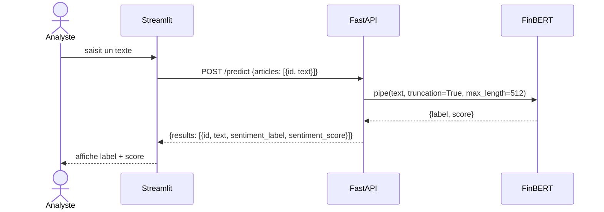
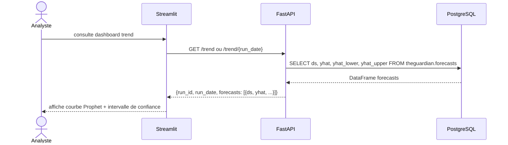
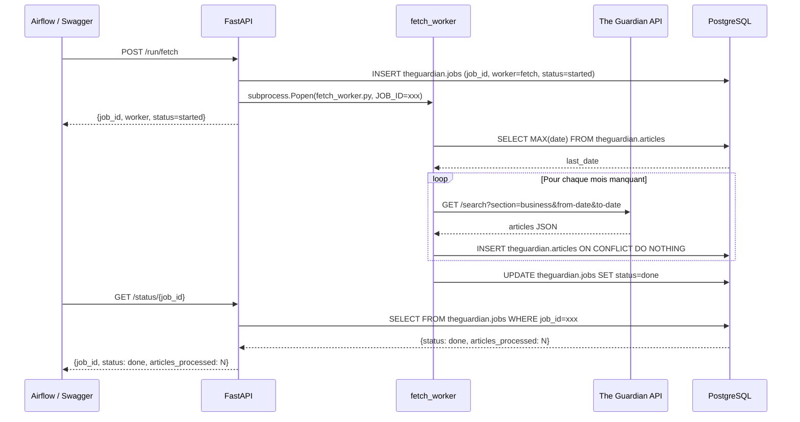
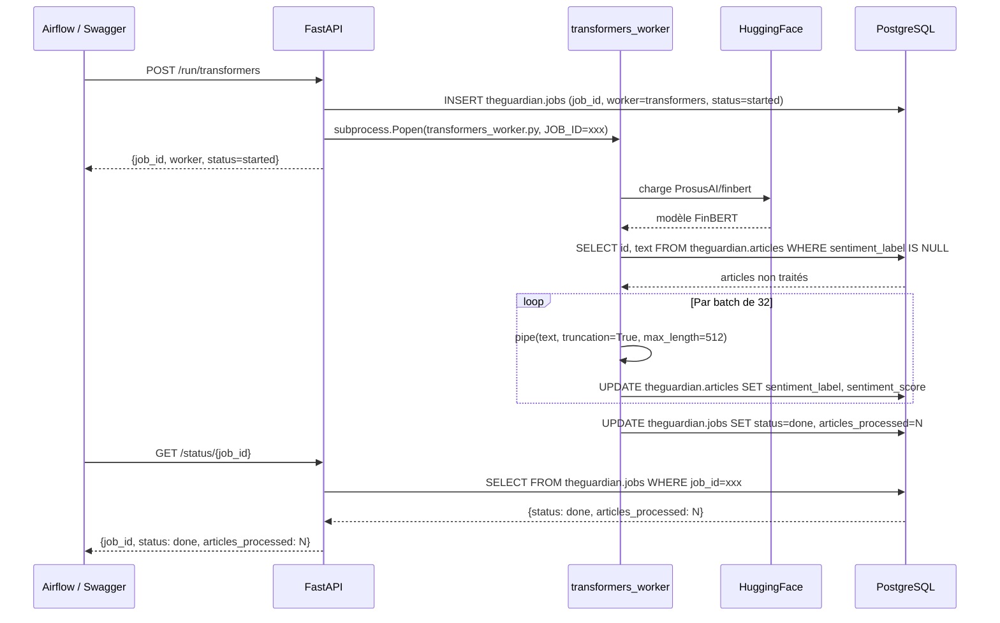
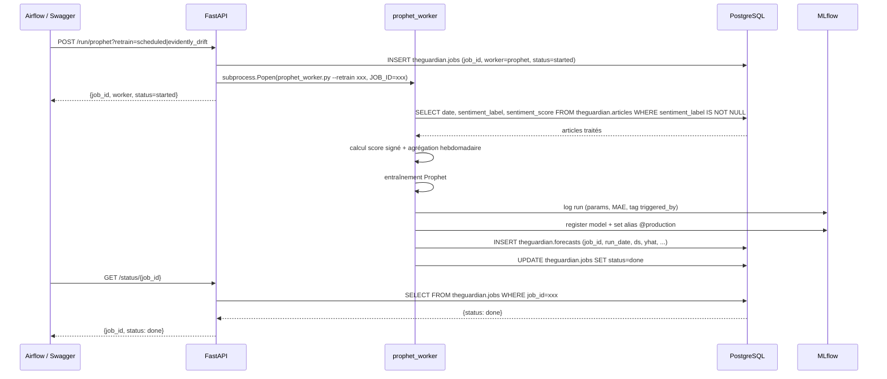
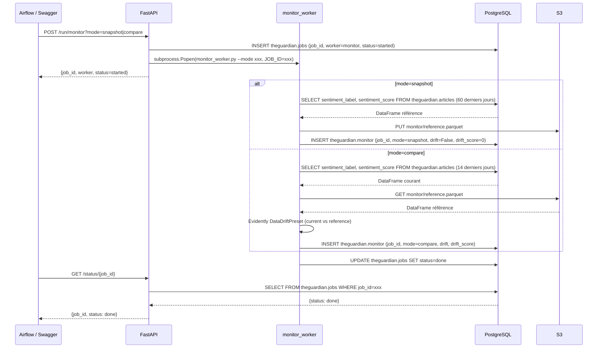
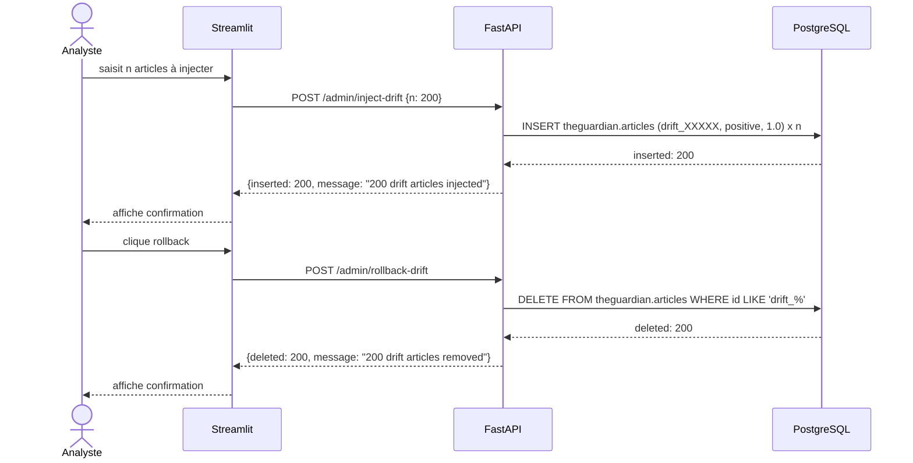
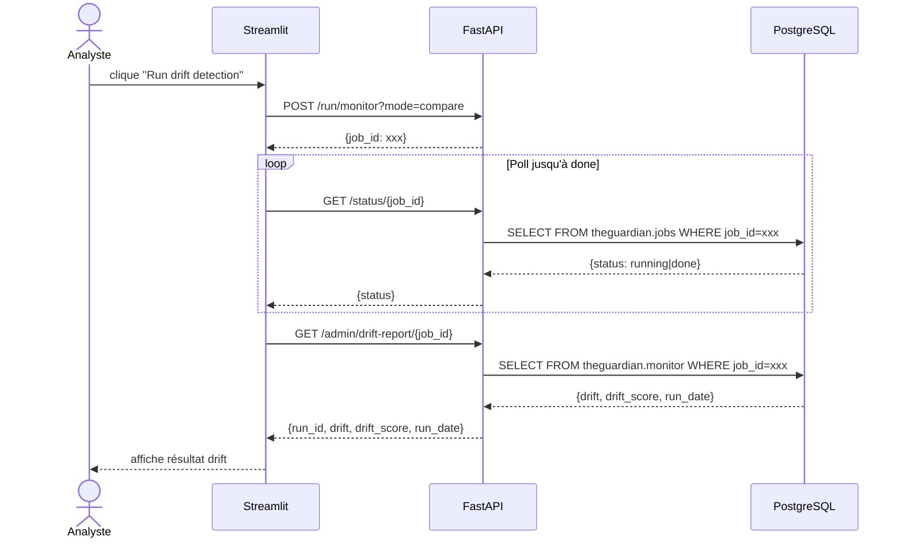

Système MLOps de veille économique automatisée : un moteur DL (Transformers) analyse le sentiment des articles The Guardian, ses sorties alimentent un modèle de tendance (Prophet), l'ensemble est géré via un pipeline CI/CD (Jenkins) avec retraining automatisé, versioning (MLflow) et monitoring (Evidently).


# Système MLOps de Veille Économique — Analyse de sentiment The Guardian


-4169E1?logo=postgresql&logoColor=white)


---

## Problème métier

Un flux quotidien de centaines d'articles économiques (rubrique Business de The Guardian) pose trois problèmes concrets à qui veut en tirer un signal exploitable :

- **Volume** — impossible à lire et synthétiser manuellement à l'échelle
- **Objectivité** — l'interprétation humaine d'un ton économique est biaisée et non reproductible d'un lecteur à l'autre
- **Dérive dans le temps** — le sentiment médiatique évolue avec le contexte économique ; un score figé perd sa pertinence sans suivi ni réentraînement

## Le projet

Construire un pipeline MLOps de bout en bout qui score automatiquement le sentiment des articles (FinBERT), en dérive une tendance agrégée sur 30 jours (Prophet), et maintient l'ensemble en conditions de production : monitoring continu du drift (Evidently), réentraînement et promotion du modèle de tendance, CI/CD (Jenkins) avec notification, architecture entièrement documentée par ADR.

---

## Intention architecturale : contraintes & réponses

Ce projet fait suite au projet [`mlops-fraud-detection`](https://github.com/Fabthenabab/mlops-fraud-detection), et reprend en connaissance de cause certains choix qui y avaient été identifiés comme des limites — documentés ici par des ADR (`docs/decisions/adr.md`) plutôt que découverts en cours de route.

| Contrainte | Réponse apportée |
|---|---|
| **Déploiement HF Spaces : un seul conteneur, un seul port** — pas de réseau entre services possible | Un seul conteneur applicatif (nginx + FastAPI + Streamlit + workers), supervisord comme process manager, nginx en reverse proxy interne routant `/api` vers FastAPI et `/*` vers Streamlit (ADR-005) |
| **Parité dev/prod** — une architecture Docker Compose en local modéliserait des microservices qui n'existent pas en prod, source de bugs d'intégration invisibles en dev | **Aucun Docker Compose, même en développement local** — supervisord dès le dev, même configuration qu'en prod (ADR-004), leçon tirée directement du projet précédent |
| **Découplage orchestrateur / compute ML** — Airflow n'est pas fait pour exécuter du calcul ML lourd, et Airflow (local) ne peut de toute façon pas accéder au filesystem des workers (HF Space distant) | Workers Python autonomes (`*_worker.py`), exposés via des endpoints FastAPI (`/run/*`), commandés par Airflow via `HttpOperator` — aucune logique ML dans les DAGs (ADR-007) |
| **Suivi d'exécution sans accès direct à XCom depuis les workers** — les workers tournent hors du contexte Airflow (HF Space), donc pas d'accès à la base de métadonnées Airflow | Pattern `job_id` : FastAPI démarre le worker en subprocess et retourne un `job_id`, le worker écrit son état et ses résultats en PostgreSQL (table `jobs`), Airflow poll `/status/{job_id}` — XCom ne transporte que des métadonnées de pilotage légères, jamais les données produites |

## Architecture

**Contexte (C4 — niveau 1)**


**Conteneurs (C4 — niveau 2)**


```
The Guardian API → fetch_worker → PostgreSQL (Neon) ← FastAPI ← Streamlit
                                        ↑                  ↑
                                   S3 (drift ref.)      Airflow (orchestration)
                                        ↑                  ↓
                                    MLflow            Jenkins (CI/CD)
```

## Stack technique

| Domaine | Outils |
|---|---|
| Source de données | The Guardian API (rubrique Business) |
| API & routage | FastAPI, Nginx (reverse proxy interne) |
| Modèle de sentiment | FinBERT (`ProsusAI/finbert`, Transformers HuggingFace), chargement via `lifespan` FastAPI |
| Modèle de tendance | Prophet (agrégation hebdomadaire du score signé, prévision 30 jours) |
| MLOps | MLflow (tracking, registry, alias `@production`), Evidently (drift FinBERT & Prophet) |
| Stockage | PostgreSQL Neon (schémas `theguardian` + `mlflow`), S3 (référence de drift, artefacts MLflow) |
| Orchestration | Airflow (4 DAGs, `HttpOperator` uniquement — aucune logique ML) |
| CI/CD | Jenkins auto-hébergé (tests critiques bloquants + smoke non bloquants, notification Discord) |
| Interface | Streamlit (predict, trend, admin) |
| Infra | Docker (conteneur unique), Supervisor (process manager, reload à chaud) |
| Notification | Webhook Discord |


---
## Diagramme de contexte


---
## Diagramme de conteneur


## Pipeline ML — un découpage fonctionnel en workers ponctuels

Contrairement au projet fraud-detection (workers permanents en tâche de fond), ici les workers sont des **scripts ponctuels lancés à la demande** via subprocess, chacun dédié à une étape :

```
fetch_worker         → interroge The Guardian API, complète les mois manquants depuis la dernière date connue en base
transformers_worker  → charge FinBERT, score par lots de 32 les articles non traités
prophet_worker       → agrège les scores, entraîne Prophet, logue et promeut le modèle sur MLflow
monitor_worker       → Evidently, mode snapshot (référence hebdomadaire sur S3) ou compare (drift quotidien)
```

Convention de nommage assumée : `*_server.py` pour les processus permanents gérés par supervisord (nginx, API, dashboard), `*_worker.py` pour les scripts ponctuels commandés par l'API — supervisord n'étant pas conçu pour des démarrages/arrêts répétés à la demande (ADR-007).

### Orchestration Airflow (4 DAGs)

```
dag_infer     (horaire)     → /run/fetch → poll → /run/transformers → poll
dag_forecast  (quotidien)   → /run/prophet?retrain=scheduled → poll
dag_monitor   (quotidien)   → /run/monitor?mode=compare → poll
                             → si drift détecté : /run/prophet?retrain=evidently_drift → poll
dag_snapshot  (hebdomadaire)→ /run/monitor?mode=snapshot → poll
```

### Deux modèles, deux logiques de drift (ADR-009)

- **FinBERT** (classifieur pré-entraîné) : le drift est **affiché**, jamais réentraîné — un changement de sentiment médiatique reflète le contexte économique réel, pas une dégradation du modèle. Le fine-tuning est hors périmètre du projet.
- **Prophet** (série temporelle) : un drift sur le MAE **déclenche un réentraînement automatique**, avec **promotion non conditionnelle** à l'amélioration du score — en période d'incertitude économique, un intervalle de confiance plus large sur un modèle à jour est une information plus fidèle qu'un modèle ancien plus précis sur un contexte qui n'existe plus.

## CI/CD

Push sur `main` → webhook GitHub → Jenkins (auto-hébergé, containerisé) :

```
Install → Lint (flake8) → pytest critical (bloquant) → pytest smoke (non bloquant) → Notification Discord
```

Suite de tests entièrement mockée (zéro appel réseau, zéro DB réelle pendant les tests). Le déploiement vers HuggingFace Spaces reste une opération manuelle volontairement hors du scope CI (`make push`) — Jenkins valide le code, il ne déploie pas.


## Choix techniques

- **Choix CI/CD justifié plutôt que par défaut** : Jenkins auto-hébergé retenu face à GitHub Actions pour garder le contrôle sur l'environnement d'exécution et la gestion locale des secrets MLflow/AWS/Neon (ADR-001)
- **Décision de conception révisée et documentée** : instance MLflow d'abord envisagée comme partagée entre projets, puis revue vers un Space dédié par projet après avoir identifié un risque de mélange des artefacts S3 sans isolation par préfixe (ADR-002)
- **Choix explicite du mode de chargement du modèle** : FinBERT chargé à la volée à chaque appel plutôt que mis en cache, en cohérence avec un usage à prédiction journalière plutôt que temps réel — un compromis de latence assumé plutôt que subi (ADR-006)
- **Persistance des prévisions plutôt que recalcul à la demande** : les forecasts Prophet sont écrits en base après chaque run, pour que l'API `/trend` ne dépende jamais de la disponibilité de MLflow dans son chemin critique — avec un bénéfice inattendu : un historique des prévisions consultable dans le temps (ADR-011)
- **Simulation de drift reproductible pour valider le pipeline** : injection d'articles fictifs préfixés `drift_` avec rollback trivial par préfixe, sans attendre une dérive naturelle des données (ADR-012)

## Limites connues & pistes d'évolution

- **Le pattern de polling HTTP (`job_id` + `/status`) atteint sa limite si le besoin évolue vers du temps réel.** Il convient très bien à un usage à fréquence journalière/horaire, mais ajoute de la latence et de la complexité de suivi qu'un WebSocket ou une file d'attente dédiée éviterait pour un cas d'usage à latence plus stricte (ADR-007, limite assumée explicitement dans le projet).
- **Seuils de drift Evidently volontairement sensibles** (`DRIFT_THRESHOLD_LABEL` / `DRIFT_THRESHOLD_SCORE` à 0.10), calibrés pour un contexte de POC — à recalibrer sur un historique de données réelles avant un usage en production (ADR-013).

---
## Structure du repo

```
├── _HF-SPACES/manager-server  # conteneur applicatif unique : API, Streamlit, workers, nginx, supervisord
├── _server-fastapi            # API FastAPI (routes predict, trend, admin, run, health)
├── _server-streamlit          # dashboard (predict, trend, admin)
├── _server-nginx               # reverse proxy
├── _server-airflow            # 4 DAGs (infer, forecast, monitor, snapshot)
├── _server-mlflow              # tracking & registry
├── _server-jenkins             # CI/CD auto-hébergé (Blue Ocean, DinD)
├── _workers                    # fetch / transformers / prophet / monitor (scripts ponctuels)
├── pipeline/core                # feature/drift, SQL, logique métier Guardian
├── pipeline/libs                # utilitaires partagés (AWS, utils)
├── tests                        # suite pytest (critical / smoke / slow / integration), entièrement mockée
├── notebooks/                   # EDA, chargement historique, entraînement Prophet
├── docs/decisions/adr.md        # 14 ADR — toutes les décisions d'architecture justifiées
├── docs/diagrams/                # diagrammes C4 + séquences
├── Jenkinsfile
└── docker-compose.yaml
```

---
## Diagrammes de séquence
 
### Flux 1 — /predict
 


### Flux 2 — /trend



### Flux 3 — /run/fetch



### Flux 4 — /run/transformers



### Flux 5 — /run/prophet



### Flux 6 — /run/monitor



### Flux 7 — /admin/inject-drift + rollback



### Flux 8 — /admin/drift-report



## Auteur

**Fabien Messinger** — Data Engineer, certifié Architecte IA (RNCP7, Jedha)
[GitHub](https://github.com/f-msngr) · [LinkedIn](https://www.linkedin.com/in/fabien-messinger)
